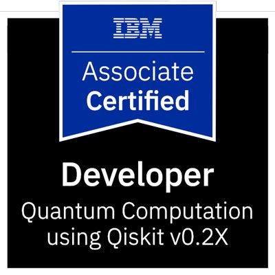
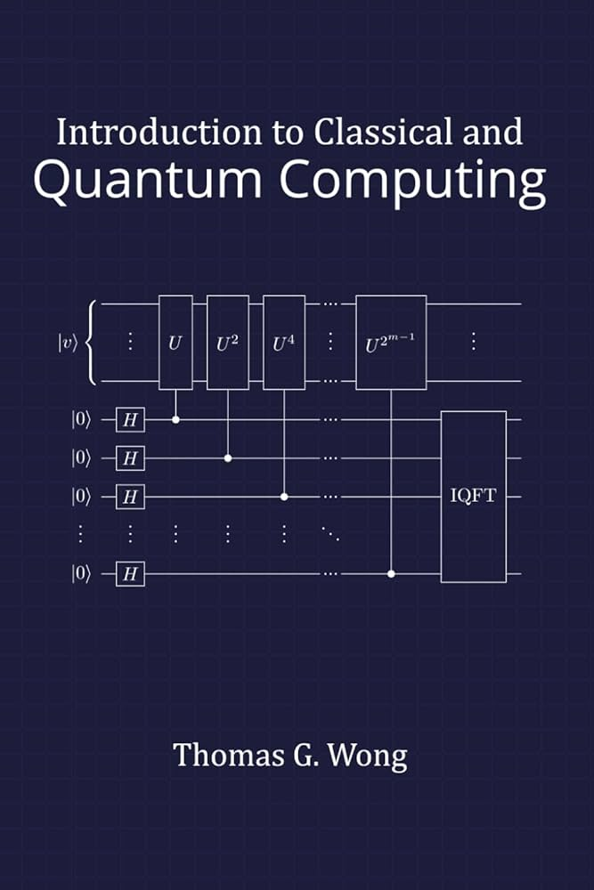

<!--eventfully doc topper -->
<p align="center" style="margin: 0 0 4px 0;">
  

</p>
<h4 align="center" style="margin: 2px 0 0 0;">Bryan's Qiskit Enviroment</h4>
<h1 align="center" style="margin: 0; padding-bottom: 0; border-bottom: none;">
  Read Me
</h1>
<h4 align="center" style="margin: 2px 0 0 0;">As of Jan 2026</h4>

<hr style="margin: 8px 0 16px 0; border: none; border-top: 1px solid currentColor; opacity: .25;">

## **<span style="text-decoration:underline;">Motivation:</span>**

This repository was created to document, store, and share my progress while I learn the qiskit api and solidify my understandings of Quantum Computation and Quantum Information. This repository will be updated in paralell with my progress working towards the **IBM Certified Quantum Computation using Qiskit v2.X** certification.

## **<span style="text-decoration:underline;">Texts Used:</span>**

The most used resources on my quantum journy.
<table>
  <tr>
    <td width="140" valign="top">
      
    </td>
    <td valign="top">
      <b>IBM Certified Associate Developer – Quantum Computation using Qiskit</b><br/>
      Built and ran Qiskit circuits, worked with measurement and basis changes, and used common primitives/tools to evaluate results on simulators and quantum hardware.
    </td>
  </tr>

  <tr>
    <td width="140" valign="top">
      
    </td>
    <td valign="top">
      <b>Qiskit Portfolio – Circuits, Experiments, and Notes</b><br/>
      Documented hands-on experiments (coin flips, state prep, simple algorithms) with clean notebooks and reproducible runs.
    </td>
  </tr>

  <tr>
    <td width="140" valign="top">
      
    </td>
    <td valign="top">
      <b>Quantum Computing Foundations – Gates, Bloch Sphere, and Measurement</b><br/>
      Practiced core gate intuition (X/H), interference, and measurement behavior; validated outcomes through simulations and measured distributions.
    </td>
  </tr>
</table>


## **<span style="text-decoration:underline;">Installation:</span>**

### To Run Locally:

**1. Clone the repo**

```
git clone REPO_URL cd qiskit_bryan
```

Do this in an accessible directory

**2. Create virtual environment**

_Windows:_

```
py -m venv .venv

`.\.venv\Scripts\activate`
```

_Mac:_

```
python3 -m venv .venv
`source .venv/bin/activate`
```

After activation, you should see `(.venv)` at the beginning of each prompt\

**3. Upgrade pip and install project dependencies**

_Important: Make sure to do the following in your virtual environment (.venv)_

`pip install --upgrade pip` --> Upgrade pip to newest

`pip install qiskit-ibm-runtime` --> Qiskit Runtime 

`pip install jupyter`--> Jupyter

`pip install qiskit`--> Qiskit Methods

`pip install numpy` --> numpy

---


This repository was created for educational and personal portfolio purposes.
I do not consent to the use of my code for training language models, machine learning systems, or other AI tools.

2026 Bryan Milosevic-Hill
